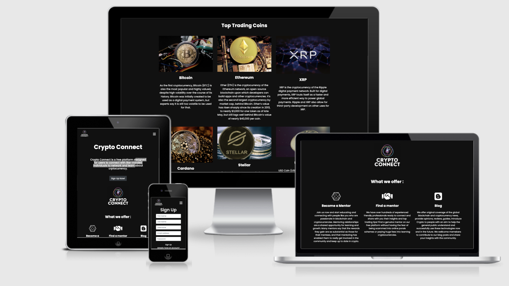

  * [**Project overview**](#--project-overview--)
  * [1. **UX**](#1---ux--)
    + [**User Stories**](#--user-stories--)
    + [**Structure**](#--structure--)
    + [**Skeleton**](#--skeleton--)
    + [**Surface**](#--surface--)
      - [**Colour & Styling**](#--colour---styling--)
        * [Colour Palette](#colour-palette)
      - [**Language/Tone**](#--language-tone--)
      - [**Styling Considerations**](#--styling-considerations--)
  * [2. **Features**](#2---features--)
    + [CRUD Functionality](#crud-functionality)
    + [**Existing Features**](#--existing-features--)
    + [**Features to consider implementing in future**](#--features-to-consider-implementing-in-future--)
  * [3. **Database Design**](#3---database-design--)
    + [**Indexes**](#--indexes--)
      - [**Members**](#--members--)
    + [**Queries**](#--queries--)
      - [**Browsing**](#--browsing--)
      - [**Users**](#--users--)
      - [**Uploading**](#--uploading--)
      - [**Deletion**](#--deletion--)
  * [4. **Technologies Used**](#4---technologies-used--)
    + [Languages](#languages)
    + [Libraries](#libraries)
    + [Editors](#editors)
    + [Tools](#tools)
    + [Database Management](#database-management)
    + [Deployment Platform](#deployment-platform)
  * [5. **Testing**](#5---testing--)
  * [6. **Deployment**](#6---deployment--)
    + [Database Deployment](#database-deployment)
    + [Application Hosting](#application-hosting)
    + [**Heroku**](#--heroku--)
      - [Creating a Heroku app](#creating-a-heroku-app)
      - [Setting Environmental Variables](#setting-environmental-variables)
      - [Deployment](#deployment)
      - [Automatic Deployment](#automatic-deployment)
    + [GitHub and GitPod repository management](#github-and-gitpod-repository-management)
    + [**How to clone 'Crypto Connect’' in GitHub, GitPod and setup on Heroku.**](#--how-to-clone--crypto-connect---in-github--gitpod-and-setup-on-heroku--)
      - [Installing Requirements](#installing-requirements)
      - [Create Collections in MongoDB](#create-collections-in-mongodb)
      - [Setup Environmental Variables](#setup-environmental-variables)
    + [Setup Unique Identifies / Environment Variables](#setup-unique-identifies---environment-variables)
      - [SECRET_KEY](#secret-key)
      - [MONGO_URI](#mongo-uri)
      - [MONGO_DBNAME](#mongo-dbname)
      - [Running Development Server](#running-development-server)
  * [7. **Credits**](#7---credits--)
    + [**Technical**](#--technical--)
    + [**Content**](#--content--)
    + [**Media**](#--media--)
    + [**Acknowledgements**](#--acknowledgements--)

# **Crypto Connect** - by Tindy Chan

## **Project overview**

# [Crypto Connect](https://crypto-connect-rhg0.onrender.com/)

Are you passionate about Cryptocurrency? [Crypto Connect](https://crypto-connect-rhg0.onrender.com/) is a free platform that allows you to connect with other like-minded professionals and learn about Cryptocurrency. Do you have any trading experience you'd like to share as well? Great news! You can create your own free account and start writing blog posts to share with the rest of the community! You can also connect and chat with other members in the community in our chat room!

The site is created to allow professionals to connect with others and learn about cryptocurrency, so is branded in a very simple classic design with white text on black background to ensure optimal legibility and minimal distraction.

I have used HTML, CSS, JavaScript and Python to build the site, ensuring it is fully responsive to user interaction on their chosen device.

## **Deployed site**
The live website can be found at the following link; [Crypto Connect](https://crypto-connect-rhg0.onrender.com/).



## 1. **UX**

This project is part of my [Code Institute](https://codeinstitute.net/) Full Stack Software Development studies, specifically the **Backend Development** module. The objective for this milestone project is to "*Create a web application that allows users to create user profiles and connect with other members, and to store and easily access blog posts, using the **CRUD** operations of **C**reate, **R**ead, **U**pdate, and **D**elete for their connections  and blog posts.

I have decided to build a cryptocurrency networking project, since I personally have a strong passion for this new blockchain technology. I feel that there are too many scams out there and not enough reliable resources or a safe haven for beginners to enter the world of cryptocurrency. I would like to create a platform where people are able to connect with each other, so they can learn and share their experiences on not only the blockchain technology itself, but also trading advice and tips! Members in the community will be able to connect with each other, discuss their views in our chatroom or upload blog posts to share anything they feel passionate about cryptocurrency.

### **User Stories**
#### Browsing

* As a user, I want the website to clearly display member’s profiles so I can be introduced to new members.
* As a user, I want the website to clearly display the blog posts to me so I can be introduced to the content.
* As a user,  I want the website to clearly display all the messages in the chat room.

#### Searching

* As a user, I want to be able to search members by keyword, so I can find recipes easily, for example by name or location.
* As a user, I want to be able to make connections with other members on the platform from search results.

#### Uploading Blog Posts

*  As a user, I want to be able to upload my own blog posts, so other users can benefit from reading them.
* As a user, I want to be able to edit and improve posts I have already uploaded.
* As a user, I want to delete posts I have already uploaded.

#### Users

*  As a user, I want to be able to register with the site, so I can upload and edit my profile and blog posts.
* As a registered user, I want to be able to login to my account, so I can access and edit my profile, and to upload, edit or delete blog posts I created.
*  As a registered user, I want to be able to make connections with other members and to remove them should I wish to.
*  As a registered user, I want to communicate with other members on the platform.

#### Site Owner Goals

*  As the site owner, I would like the site to be  the “go-to” platform for users to learn and discuss cryptocurrency.

* As the site owner, I would like to create a community for users in the blockchain technology / crypto market.

*  As the site owner,I would like to hear feedback from users to continuously improve user experience.

#### General

* As a user I want to receive clear feedback for my actions on the site, so I know they are complete or if further steps are needed.
* As a user I want to contact the admin should I wish to.

### **Structure**
Overview of site and page structure, explaining functionality and purpose.

#### Home Page:

  * **Navigation Bar/Footer**: For easy navigation across the site and to external resources such as social media pages.
  * **Website Logo**: To easily identify the 'Crypto Connect’' site branding.
  * **Site Features**: To easily provide users with an overview of the website’s features.
  * **Top Trading Coins Cards**: To easily provide users with information about top trading cryptocurrencies.
  * **Sign Up Button**: To allow users to easily access the registration page.
  * **Contact Form**: To allow users to contact admin directly through a form.

#### Members Page:
 * **Search Bar**: Text input bar, allowing users to search members by full name and location.
 * **Search Results**: Once user search input, members are replaced by members cards matching the search query.
 * **Members Cards**: To easily provide users key information on members in the community, including visual image, type of member, full name, birthday, location, job title, interests, experience and date joined.
 * **Connection Button**: To allow users to connect with other members with easy access.

#### My Profile:
 * **Profile Card**: To easily provide users key information of their own profile, including visual image, type of member, full name, birthday, location, job title, interests, experience and date joined.
 * **Update Profile Button**: To allow users to edit their profile with easy access.

#### My Connections:
 * **Members Cards**: To easily provide users key information on members they have connected with.
 * **View Profile Button**: To allow users to be directed to a member's profile page for further information.
 * **Remove Connection Button**: To allow users to remove connections with members they have connected with.

#### Chat
 * **Go to chat button**: To allow users to be directed to the chat room to chat with other members in the community.
 * **Chat Message Box**: Text input box, allowing users to write their message.
 * **Send Message button**: To allow users to submit their message and have it displayed in the chatroom.
 * **Refresh Chat Button**: To allow users to refresh the chat page to receive updated messages from the community.

#### Crypto Blog Page:

 * **Add New Blog Post Button**: To allow users to be directed to add_blog page to contribute to the blog by filling out a form.
 * **Blog Post Cards**: To easily provide users key information on the blog post, including blog title, author and date published.
 * **View Post Button**: To allow users to be directed to a specific blog post page to read the blog post.
 * **Edit Post Button**: To allow users who created the blog post to be directed to edit_blog page to edit the post they contributed.
 * **Delete Button**: To allow users who created the blog post to remove the blog post they contributed from the platform.

#### Blog Details Page:
 * **Blog Post Image**: Visual image uploaded by user/ default image for the blog post.
 * **Author**: Display author of the blog post.
 * **Published date**: Display the date of when the blog post was posted.
 * **Blog Content**: Display content of the blog post.

#### Sign In Page:

 * **Username Input**: Text input box, allowing users to enter their username.
 * **Password Input**: Text input box, allowing users to enter their password.
 * **Sign In Button**: To allow users to submit entered information, and if correct credentials will be directed to the profile page.
 * **Sign Up  Button**: To allow users to be directed to the registration page.

#### Sign Up Page:

 * **First Name Input**: Text input box, allowing users to enter their First Name.
 * **Last Name Input**: Text input box, allowing users to enter their Last Name.
 * **Username Input**: Text input box, allowing users to enter their username.
 * **Email Input**: Text input box, allowing users to enter their email address.
 * **Password Input**: Text input box, allowing users to enter their password.
 * **Sign Up Button**: To allow users to submit entered information and register for an account.

### **Skeleton**

At this point I began creating wireframes, using the above structure considerations. I used [Balsamiq](https://balsamiq.com/) these below;

* [Home Page](assets/README/wireframes/wireframe-index.html.png)
* [Members Page](assets/README/wireframes/wireframe-members.html.png)
* [Profile Page](assets/README/wireframes/wireframe-profile.html.png)
* [Blog Page](assets/README/wireframes/wireframe-blog.html.png)
* [Login / Registration Page](assets/README/wireframes/wireframe-register-login.html.png)

### **Surface**

This is the sensory design section of a website, or how it looks, feels and sounds.

The logo comprises animated rings with a spaceship in the centre, along with the app name at the bottom. This gives a very eye-catching and clean aesthetic . The spaceship represents the dream of many crypto-investors - “Going to the Moon!”. This is the jackpot of cryptocurrency. It's when the price of a cryptocurrency skyrockets off the charts. It refers to a strong belief that certain cryptocurrency is soon going to rise significantly in price.


#### **Colour & Styling**

The site is created to allow professionals to connect with others and learn about cryptocurrency, so it is branded in a very simple classic design with white text on black background to ensure optimal legibility and minimal distraction. I chose to use a colour palette consisting of whites and black shades, with cadet blue and teal to highlight and  for the hoovering effects.

The resulting palette is below;


##### Colour Palette

* White - #fff
* Black - #111
* Black- #000
* Cadet blue- #5f9ea0
* Teal - #008080


#### **Language/Tone**

I wanted the language to reflect a professional and educational atmosphere, whilst also reflecting a friendly and engaging style. Therefore content was written in this style, avoiding overloading of information or information that is too technical to understand.

Similarly, I wanted to use fonts that reinforce the identity of the site,  to match the cryptocurrency theme and also be easy to read. To achieve this I used [Google Fonts](https://fonts.google.com/);

* [Poppins](https://fonts.google.com/specimen/Poppins) - A geometric sans-serif typeface published by Indian Type Foundry in 2014.
* Sans-serif - Web safe font, used if primary font fails to load.

#### **Styling Considerations**

During the pre-development phase, I listed out some styling ideas that I thought would be beneficial to the website. Many of these can be found in wireframes.

* Font Awesome Icons : with hover effects to highlight key info 
* Navigation
* Sticky top
* Mobile Side Nav: 'Burger' menu icon, expanding into side navbar on click
* Logo: Navigates to the index page on click
* Members Cards
* Visual Image showing member’s profiles 
* Blog Post Banner / Image
* Visual Image to accompany blog content


## 2. **Features**
The site allows users to register for an account. Users are able to login and logout of the site. They can create, upload and update their own profiles. Registered users are able to view other member’s profiles and make connections with them. Users can search for other members using their name or location. Users can see all the connections they have made in their profile page and remove existing connections at any time. Users are able to upload new blog posts, edit and delete existing ones that they have created. 

### CRUD Functionality

Users can :

- Add their profile
- Edit their profile
- Add Connections
- Remove Connections
- Add blog posts
- Edit thier blog posts
- Delete their blog posts

### **Existing Features**
#### The Header:

* **Website Logo**: Builds brand awareness and identity amongst users.
* **Navigation Bar**: Enable users to navigate the site easily and intuitively, as well as login/register their account.

#### The Footer:

* **Copyright**: Copyright information for brand awareness.
* **Social Links**: Links to Social Media for brand awareness.

Both the Header and Footer are present and consistent on all website pages.

#### Home page:

* **Website Logo**: Visually pleasing design, allowing users to immediately identify the site brand.
* **Sign Up Button**: Allows users to be directed to the registration page to sign up for an account.
* **Site Features**: Brief content showing site features.
* **Top Trading Coins**: Cards showing top trading coins with information about each one.
* **Contact Form**: Allows users to contact admin for feedback.

#### Members Page:
* **Member Cards**: Display other member’s  key information, including visual image, type of member, full name, birthday, location, job title, interests, experience and date joined. Users are able to connect with other members via a click of a button. They are able to remove any connections at any time.
* **Search Results**: Once user search input, members are replaced by members cards matching the search query.

#### My Profile:
* **Profile Card**: Card showing relevant information on users profile, allowing users to quickly identify if they are using their desired account.
* **Add Profile Button**: To allow users to create their profile.
* **Update Profile Button**: To allow users to edit their profile with easy access.

#### My Connections:
* **Members Cards**: Display all the members’ profiles that the users have connected with. Option to remove connections at any time via a click of a button.

#### Chatroom:
* **Chat room**: Users are able to chat with other members in the chat room.

#### Add Profile page:

* **Input areas for below profile data points**:
    * **Members type** - Text 
    * **Full name** - Text
    * **Birthday** - Date
    * **Location** - Text
    * **Job Title** - Text
    * **Experience** - Text
    * **Interests** - Text
    * **Profile Image** - Url or default img

#### Edit Profile page:

* **Input areas for below profile data points**:
    * **Members type** - Text 
    * **Full name** - Text
    * **Birthday** - Date
    * **Location** - Text
    * **Job Title** - Text
    * **Experience** - Text
    * **Interests** - Text
    * **Profile Image** - Url or default img

#### Crypto Blog Page:

* **Blog Image**: Default banner for blog posts or relevant image uploaded by author to accompany blog post.
* **Blog Information**: Display key information on the blog post, including blog title, author and date published.
* **Blog Content**: Display blog content.
* **Submitted Blog Posts**: Users are able to easily and quickly access to review, edit or delete blog posts they have created.

#### Add Blog Post page:

* **Input areas for below Blog posts data points**:
    * **Blog_Title** - Text
    * **Blog Image** - Url or default img
    * **Blog Content** - Text

#### Edit Blog Post page:

* **Input areas for below blog post data points**:
    * **Blog_Title** - Text
    * **Blog Image** - Url or default img 
    * **Blog Content** - Text

#### Sign Up Page:

  * **First Name Input**: Text input box, allowing users to enter their First Name.
  * **Last Name Input**: Text input box, allowing users to enter their Last Name.
  * **Username Input**: Text input box, allowing users to enter their username.
  * **Email Input**: Text input box, allowing users to enter their email address.
  * **Password Input**: Text input box, allowing users to enter their password.
  * **Sign Up Button**: To allow users to submit entered information and register for an account.

### **Features to consider implementing in future**

As this is a community-focused platform, several future features would be worth considering implementation:
* **Social Media Sharing** - Allow users to share blog posts or their members' cards directly to their social media accounts.
* **Advanced chat functionality** - Allows users to private message individual members and receive notifications when they receive a message.
* **Current Crypto Price Charts** - Visual graphs to show users current prices of trending cryptocurrencies.
* **User Comment Section** - Allow users to comment on each other's blog posts, allowing constructive feedback and additional context to blog posts.
* **Direct Image Upload** - Embed image upload functonality to the site using [Cloudinary](https://cloudinary.com/).
* **Optimised Image Delivery** - Page load speeds could be sped up via using compression on user-uploaded images, to ensure they are srved in a fully optimised state. This could be done using Cloudinary to automatically compress images during upload.
* **User Administration** - Add user administration page, allowing admins to manage users accounts e.g. suspend accounts, set other users to admin etc.
* **Advanced User Profile** - Allow users to customize their own profile with custom information they wish to provide and share with other members.

## 3. **Database Design**
MongoDB was the database solution used for the website development, using the below, structured plan.

**Users Collection**

| **Key**        |  **Type**     | **Purpose**|
|-------------- |-------------- |-------------|
| _id           |  ObjectId     | ObjectId of this document
| firstname     |   String      | stores the first name of the user 
| lastname      |   String      | stores the last name of the user 
| username      |   String      | stores the username of the user 
| email         |   String      | stores the email address of the user 
| password      |   String      | stores the hashed password of the user 
| connections   |   Array       | stores the connections of the user 
| date_created  |   String      | stores the date the document was created 

**Profiles Collection**

| **Key**        |  **Type**     | **Purpose**|
|-------------- |-------------- |-------------|
| _id           |  ObjectId     | ObjectId of this document
| member_type   |   String      | stores the members type of the user 
| fullname      |   String      | stores the full name of the user 
| birthday      |   String      | stores the birthday of the user 
| location      |   String      | stores the location of the user 
| job_title     |   String      | stores the job title of the user 
| interest      |   String      | stores the interest of the user 
| image         |   String      | stores the image of the user
| created_by    |   String      | stores the username who created the profile 
| date_created  |   String      | stores the date the document was created 

**Blogs Collection**

| **Key**        |  **Type**     | **Purpose**|
|-------------- |-------------- |-------------|
| _id           |  ObjectId     | ObjectId of this document
| blog_title    |   String      | stores the title of the blog post
| content       |   String      | stores the content of the blog post
| image         |   String      | stores the image of the blog post
| created_by    |   String      | stores the username who created the blog post 
| date_created  |   String      | stores the date the document was created 

### **Indexes**

#### **Members**

<details>
<summary>1. Text index on member’s  full name and location, allowing for text searches.</summary>

```
mongo.db.profiles.create_index([
  ("profile_fullname", "text"),
  ("profile_location", "text"),
  ])
```
</details>

### **Queries**

#### **Browsing**

<details>
<summary>1. Find members:</summary>

```
list(
  mongo.db.profiles.find({"$text": {"$search": search}})
  )
```
</details>

#### **Users**
<details>
<summary>1. Find a specific user account based on username:</summary>

```
mongo.db.users.find_one(
        {"username": username}
    )
```
</details>

<details>
<summary>
2. Insert a new user record into the database, with a defined username, password and user role:
</summary>

```
register = {
            "username": request.form.get("username").lower(),
            "password": generate_password_hash(request.form.get("password")),
            "role": "user"
        }
        mongo.db.users.insert_one(register)
```
</details>

#### **Uploading**
<details>
<summary>
1. Add a new connection:
</summary>

```
@app.route("/add_connection/<profile_id>", methods=["GET", "POST"])
def add_connection(profile_id):
    if request.method == "POST":
        user = mongo.db.users.find_one({"username": session["user"].lower()})
        connections = mongo.db.users.find_one(user)["connections"]
        # if member is already connected
        if ObjectId(profile_id) in connections:
            flash("You are already connected!")
            return redirect(url_for("members"))
        # otherwise adds member to users connections
        mongo.db.users.update_one(
             user, {"$push": {
                "connections": ObjectId(profile_id)}})
```
</details>
<details>
<summary>
2. Add a new blog post:
</summary>

```
def add_blog():
   if request.method == "POST":
       # default values if fields are left blank
       default_img = ("blog_image.png")
       blog = {
           "blog_title": request.form.get("blog_title"),
           "content": request.form.get("content"),
           "image": request.form.get("image") or default_img,
           "created_by": session["user"],
           "date_created": date.strftime("%d %b %Y"),
       }
       mongo.db.blogs.insert_one(blog)

```
</details>

<details>
<summary>
3. Edit a blog post:
</summary>

```
def edit_blog(blog_id):
   if request.method == "POST":
       # default values if fields are left blank
       default_img = ("blog_image.png")
       update = {
           "blog_title": request.form.get("blog_title"),
           "content": request.form.get("content"),
           "image": request.form.get("image") or default_img,
           "created_by": session["user"],
           "date_created": date.strftime("%d %b %Y")
       }
       mongo.db.blogs.update({"_id": ObjectId(blog_id)}, update)
```
</details>

#### **Deletion**
<details>
<summary>
1. Delete a blog post:
</summary>

```
def delete_blog(blog_id):
   mongo.db.blogs.remove({"_id": ObjectId(blog_id)})
   flash("Blog Post has been deleted")

```
</details>
<details>
<summary>
2. Remove a connection:
</summary>

```
@app.route("/remove_connection/<profile_id>", methods=["GET", "POST"])
def remove_connection(profile_id):
    if request.method == "POST":
        user = mongo.db.users.find_one({"username": session["user"].lower()})
        mongo.db.users.update_one(user, {
            "$pull": {"connections": ObjectId(profile_id)}})

```
</details>

## 4. **Technologies Used**

### Languages
<ul>
<li><a href="https://en.wikipedia.org/wiki/HTML">HTML</a> - Programming language providing content and structure of the website.</li>
<li><a href="https://en.wikipedia.org/wiki/CSS">CSS</a> - Programming language providing styling of the website.</li>
<li><a href="https://en.wikipedia.org/wiki/JavaScript">JavaScript</a> - Programming language used for various interactive elements of the website, including game logic, audio options etc.</li>
<li><a href="https://en.wikipedia.org/wiki/Python_(programming_language)">Python</a> - Programming language used to drive core site functionality including user login and push/retrieving database information.</li>
<li><a href="https://en.wikipedia.org/wiki/Jinja_(template_engine)">Jinja</a> - Used to generate HTML from site templates</li>
</ul>

### Libraries
<ul>
<li><a href="https://fontawesome.com/">Font Awesome</a> - Library used for icons, such as social links and other images.</li>
<li><a href="https://fonts.google.com/">Google Fonts</a> - Font style library.</li>
<li><a href="https://jqueryui.com/">jQuery</a> - JavaScript library used for simplification of JS scripts and DOM manipulation.</li>
<li><a href="https://flask.palletsprojects.com/en/1.1.x/">Flask</a> - Micro-framework to simplify Python scripting and web server tasks.</li>
<li><a href="https://werkzeug.palletsprojects.com/en/1.0.x/">Werkzeug</a> - Python library to manage user management integrity.</li>
<li><a href="https://socket.io/demos/chat/)">Socket.IO</a> - Used to create the chatroom functionality</li>
</ul>


### Editors
<ul>
<li><a href="https://github.com/">GitHub</a> - Remote code repository.</li>
<li><a href="https://gitpod.io/">GitPod</a> - IDE (Integrated Development Environment), for writing, editing and saving code.</li>
<li><a href="https://balsamiq.com/">Balsamiq</a> - Wireframes for visual design testing.</li>
</ul>

### Tools
<ul>
<li><a href="https://developer.chrome.com/docs/devtools/">Chrome DevTools</a> - Chrome DevTools is a set of web developer tools built directly into the Google Chrome browser.</li>
<li><a href="http://ami.responsivedesign.is/">Am I Responsive?</a> - Responsive design demo in ReadMe summary.</li>
<li><a href="https://www.responsivedesignchecker.com/">Responsive Design Checker</a> - Check website response across device types.</li>
</ul>

### Database Management
<li><a href="https://www.mongodb.com/">MongoDB</a> - Cloud based database management system, used for storing user profile and recipe information.</li>
</ul>


### Deployment Platform 
<ul>
<li><a href="https://www.heroku.com/">Heroku</a> - Remote hosting platform, for hosting of python driven websites and applications.</li>
</ul>

## 5. **Testing**

The testing process can be seen in the [TESTING.md](testing.md) document.

## 6. **Deployment**

### Database Deployment

### Application Hosting
### **Heroku**

The site is hosted using [Heroku](https://www.heroku.com/), deployed directly from the master branch of GitHub. The deployed site will update automatically as new commits are pushed to the master branch.

#### Creating a Heroku app
- From the Heroku dashboard:
  - Select "New"
  - Select "Create new app"

- Add new app details to form:
  - Add app name (must be unique)
  - Select region
  - Click "Create App"

#### Setting Environmental Variables
- From the Heroku dashboard:
  - Select your app from the list

- Select "Settings" from the top menu:
  - Under 'Config Vars', select "Reveal Config Vars"
  - Add environment variables in key-value pairs, click "Add" to add additional pairings.

#### Deployment
- Create required deployment files in the repository:
  - requirements.txt
      - Lists the required python modules for Heroku to install.
    - To create:
      - In your IDE terminal, type: ``pip freeze > requirements.txt``

  - Procfile
      -  Tell Heroku the command to launch the app.
    - To create:
      - in your IDE terminal, type: ``python app.py > Procfile``

  - .gitignore (optional)
      - Lists files and directories which should be deployed to live app, such as files with environmental passkeys.
    - To create:
      - In your IDE terminal, type: ``touch .gitignore``
      - List the files and directories to be excluded from live deployment, within the .gitignore file.
      - Save in your repository root directory.

- From the application top menu:
  - Select 'Deploy'
  - Choose your Deployment method:
    - Github:
      - Select the correct Github account.
      - Type in the repository name you wish to deploy.
      - Choose the correct repository from search results.
      - Select "Connect"

    - Manual Deployment:
      - Choose the correct branch you wish to deploy from the drop-down.
      - Select "Deploy Branch"
      - Heroku will return "Your App has successfully deployed". If this shows an error, troubleshooting will be needed.

#### Automatic Deployment
- From the application top menu:
  - Select 'Deploy'
  - Ensure app is connected to correct repository
  - Under 'Automatic Deployment' section:
    - Select 'Enable Automatic Deployment"

### GitHub and GitPod repository management

### **How to clone 'Crypto Connect’' in GitHub, GitPod and setup on Heroku.**

To run a version of the site locally, you can clone this repository using the following steps;

In a code editor of your choice;

1. Go to [GitHub.com](https://github.com/)
2. Click on 'Repositories'.
3. Click on 'Crypto Connect’.'
4. Click on the 'Code' button.
5. Under 'HTTPS' click the clipboard icon to the right of the URL.
6. In your IDE of choice, open a repository or create a new repository.
7. Open Terminal \('Terminal' then 'New Terminal' from the top ribbon menu in GitPod.\)
8. Type 'git clone', paste URL link and press enter.

Additional information around these cloning steps can be found on [GitHub Pages Help Page](https://docs.github.com/en/github/creating-cloning-and-archiving-repositories/cloning-a-repository).
&nbsp;

#### Installing Requirements
- Install all requirements modules to your local IDE with the following CL:

```
 pip3 install -r requirements.txt
```

#### Create Collections in MongoDB

- Login to your MongoDB account
- Create a Cluster

- Create a database using the following architecture;

**Users Collection**

| **Key**        |  **Type**     | **Purpose**|
|-------------- |-------------- |-------------|
| _id           |  ObjectId     | ObjectId of this document
| firstname     |   String      | stores the first name of the user 
| lastname      |   String      | stores the last name of the user 
| username      |   String      | stores the username of the user 
| email         |   String      | stores the email address of the user 
| password      |   String      | stores the hashed password of the user 
| connections   |   Array       | stores the connections of the user 
| date_created  |   String      | stores the date the document was created 

**Profiles Collection**

| **Key**        |  **Type**     | **Purpose**|
|-------------- |-------------- |-------------|
| _id           |  ObjectId     | ObjectId of this document
| member_type   |   String      | stores the members type of the user 
| fullname      |   String      | stores the full name of the user 
| birthday      |   String      | stores the birthday of the user 
| location      |   String      | stores the location of the user 
| job_title     |   String      | stores the job title of the user 
| interest      |   String      | stores the interest of the user 
| image         |   String      | stores the image of the user
| created_by    |   String      | stores the username who created the profile 
| date_created  |   String      | stores the date the document was created 

**Blogs Collection**

| **Key**        |  **Type**     | **Purpose**|
|-------------- |-------------- |-------------|
| _id           |  ObjectId     | ObjectId of this document
| blog_title    |   String      | stores the title of the blog post
| content       |   String      | stores the content of the blog post
| image         |   String      | stores the image of the blog post
| created_by    |   String      | stores the username who created the blog post 
| date_created  |   String      | stores the date the document was created 

#### Setup Environmental Variables
- Create a '.gitignore' file in the root directoy
- Add 'env.py' and '__pycache__/' to the file list within .gitignore
- Create a 'env.py' file
- In the 'env.py' file write the following code;

```
import os

os.environ.setdefault("IP", "0.0.0.0")
os.environ.setdefault("PORT", "5000")
os.environ.setdefault("SECRET_KEY", "[UNIQUE ID]")
os.environ.setdefault("MONGO_URI", "[UNIQUE ID]")
os.environ.setdefault("MONGO_DBNAME", "[UNIQUE ID]")

```

Note: For each sectionedn noted as [UNIQUE ID], you will need to provide your own unique identifier. These must also be aligned to Heroku environmental variables.

### Setup Unique Identifies / Environment Variables

#### SECRET_KEY

This is required when using flash() and session() functions in flask. The key can be of your own choice, but it's advisable to use a randomly generated secure key from websites such as [RandomKeyGen.com](https://randomkeygen.com/).

#### MONGO_URI

This is used to connect you application to your MongoDB cluster.

- Click 'Overview' tab from your Cluster, followed by 'Connect'.

- Select 'Connect your application' from following window.

- Select your correct version of Python and copy the connection string.

- Replace the 'username' and 'password' text, with the relevant criteria you setup in 'Database Access'.

#### MONGO_DBNAME

This is the name of your database in MongoDB. Which can be found under the 'Collections' tab, under your cluster.

#### Running Development Server
This command is only available in Gitpod.

To launch a Http server using the development mode code for the application, use the following command in your IDE:

```

python3 app.py http.server

```

The IDE will then open a port with an http address for you to access.


## 7. **Credits**

### **Technical**
* [w3Schools](https://www.w3schools.com/) -For checking proper syntax of HTML and CSS elements and codes for Profile Tabs functionality.
* [Slack](https://slack.com/intl/en-gb/) -Code function for flash messages.
* [Autoprefixer](https://autoprefixer.github.io/) - For generating CSS browser prefixes.
* [Stackoverflow](https://stackoverflow.com/) - For researching and troubleshooting JavaScript and Python code issues.
* [MongoDB Documentation](https://docs.mongodb.com/) - For researching and troubleshooting database code commands and issues.

### **Content**

All text content on the site was written originally by myself, with the below notes;

* Top trending coins content were obtained from [The 10 Most Popular Cryptocurrencies, and What You Should Know About Each Before You Invest](https://time.com/nextadvisor/investing/cryptocurrency/types-of-cryptocurrency/).

### **Media**

The photos and images used for this site were obtained from :

* [Logo](https://www.canva.com/) - Logo created on Canva.com.
* [Bitcoin](https://images.unsplash.com/photo-1620778182530-703effa65a06?ixid=MnwxMjA3fDB8MHxwaG90by1wYWdlfHx8fGVufDB8fHx8&ixlib=rb-1.2.1&auto=format&fit=crop&w=1650&q=80)
* [Etherum](https://images.unsplash.com/photo-1622790698141-94e30457ef12?ixid=MnwxMjA3fDB8MHxwaG90by1wYWdlfHx8fGVufDB8fHx8&ixlib=rb-1.2.1&auto=format&fit=crop&w=1504&q=80)
* [XRP](https://nulltx.com/wp-content/uploads/2018/10/xrp-logo-featured.png)
* [Cardano](https://images.unsplash.com/photo-1622538425721-3996753e747d?ixid=MnwxMjA3fDB8MHxwaG90by1wYWdlfHx8fGVufDB8fHx8&ixlib=rb-1.2.1&auto=format&fit=crop&w=1504&q=80)
* [Stellar](https://i1.wp.com/personal-financial.com/wp-content/uploads/2020/07/The-Stellar-Lumens-XLM-community-called-to-decide-on-the.jpg?resize=780%2C470&ssl=1)
* [USD Coin](https://static.news.bitcoin.com/wp-content/uploads/2021/02/83dqXDjb-circle-launches-usd-coin-on-the-stellar-network.jpg)

### **Acknowledgements**

* Thanks to my mentor, [Tim Nelson](https://github.com/TravelTimN) for his encouragement and expert advise on the development of this project.
* Thanks to all the tutors on Code institue for thier constant support, time and patience.
* Thanks to those on the Slack community for answering my many questions 24:7!
* Thanks to my two sons - Chubby and Klaus, friends and family for the love and support, reviewing the app and offering constructive feedback.


