# Crypto Connect Testing

- [Validation](#validation)
  * [W3 HTML](#w3-html)
  * [W3 CSS](#w3-css)
  * [JavaScript](#javascript)
  * [Python](#python)
  * [Google Lighthouse Audit](#google-lighthouse-audit)
- [Responsive Device & Browser Testing](#responsive-device--browser-testing)
  * [Responsiveness](#responsiveness)
  * [Browser Compatibility](#browser-compatibility)
- [Testing User Stories](#testing-user-stories)
- [Issues I had to overcome](#issues-i-had-to-overcome)
- [Issues still to overcome](#issues-still-to-overcome)

## Validation

### W3 HTML

I validated the HTML with [W3C Validation Service](https://validator.w3.org/). All the errors shown were related to jinja templating as the W3C Validator for HTML does not understand the Jinja templating syntax. Apart from that, all of the codes were validating fine with no other issues raised.

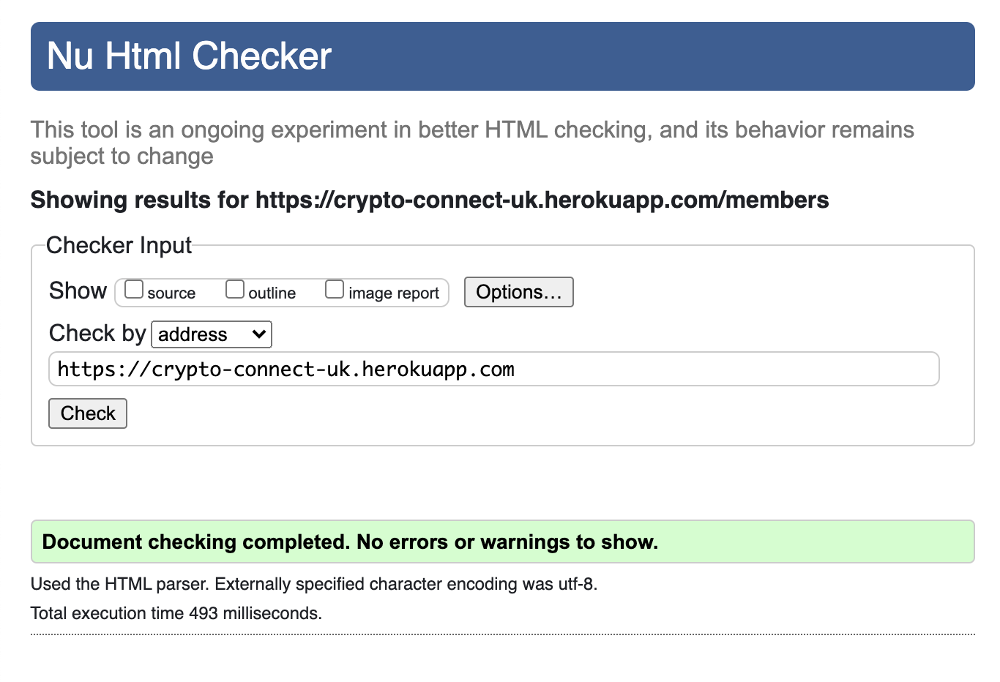

### W3 CSS

I validated the CSS with the [W3 Validation Service](https://jigsaw.w3.org/css-validator/) and it found no errors.

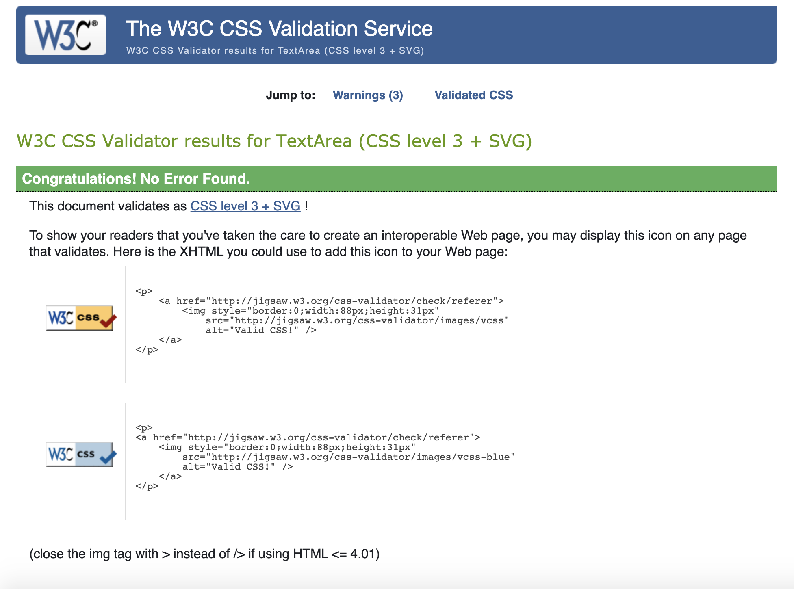

### JavaScript

I validated the JavaScript with [JSHint](https://jshint.com/).

Script.js

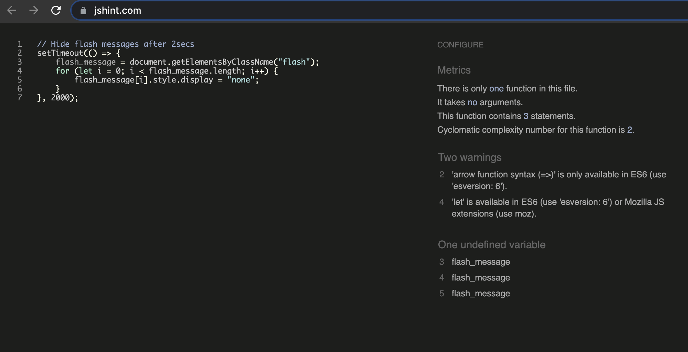

profile_script.js

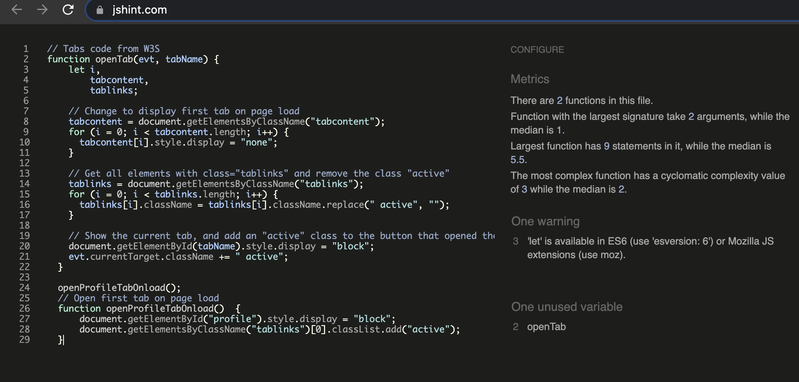
 
 I did not make any changes to the code despite the warnings as this code was taken from W3Schools.

### Python

I validated the Python code was PEP 8 compliaint via the [PEP8 Online](http://pep8online.com/) and [SNYK](https://snyk.io/product/open-source-security-management/) and found no errors.

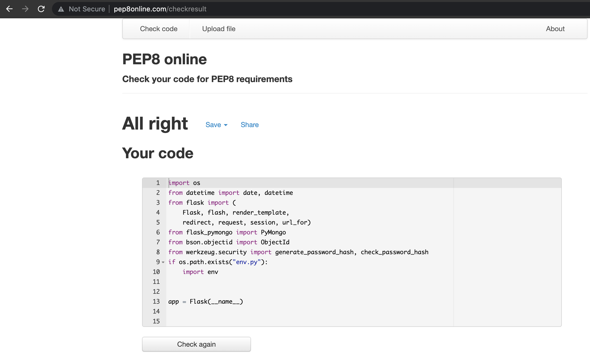

### Google Lighthouse Audit

I used Google's lighthouse audit in the Chrome DevTools to test the website conforms positively with Google's performance metrics.

After running the audit, the site received the below scores;

This shows 90%+ scores for all areas, apart from Best Practices.
Upon checking the reasoning for the low Best Practices score, I decided to not take further action to improve the score as this was due to the logo with a low resolution. The animated logo is clearly visable across all devices and resolutions, therefore no further step is taken to improve its resolution.

## Responsive Device & Browser Testing

This website was developed using the Mobile First philosophy.
To test the responsiveness of the site I used [Chrome DevTools](https://developers.google.com/web/tools/chrome-devtools) and [Responsive Design Checker](https://www.responsivedesignchecker.com/).

### Responsiveness

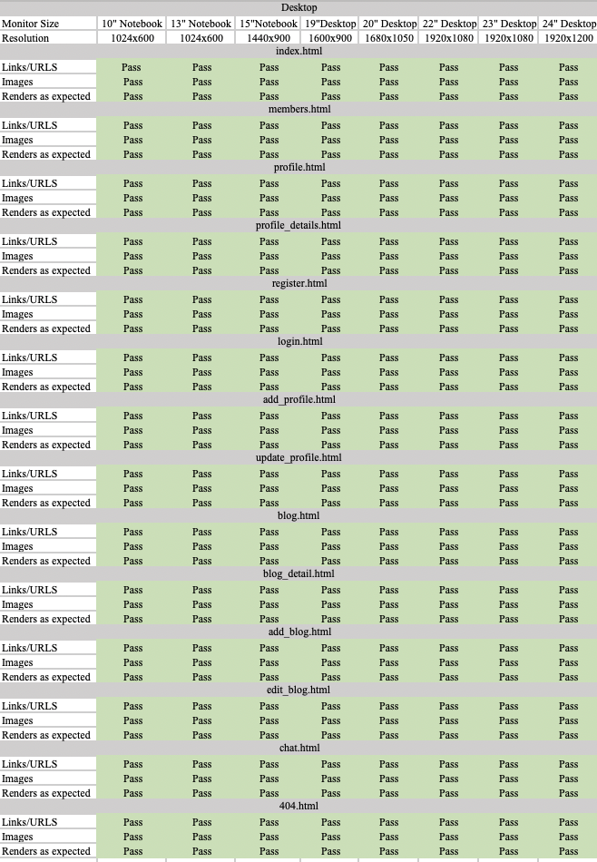

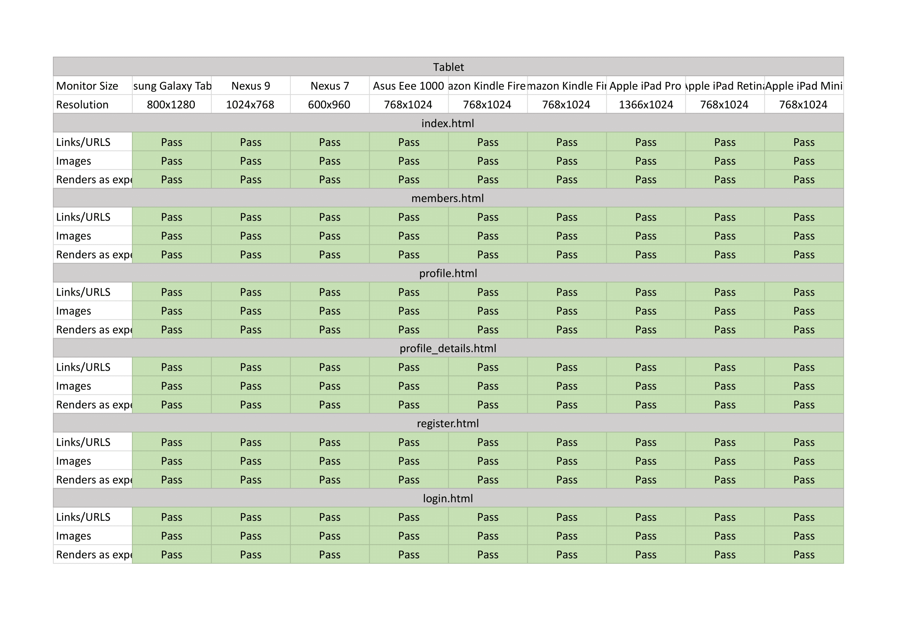
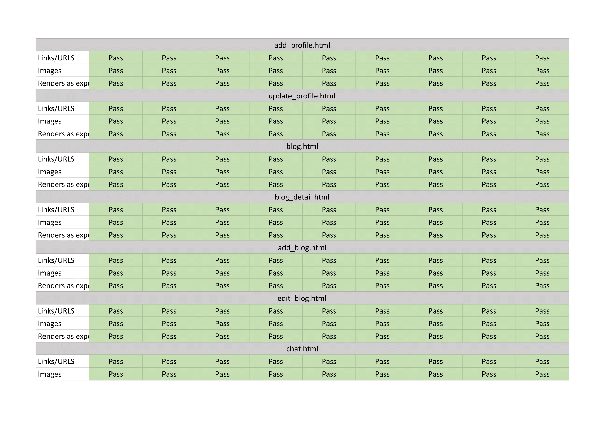
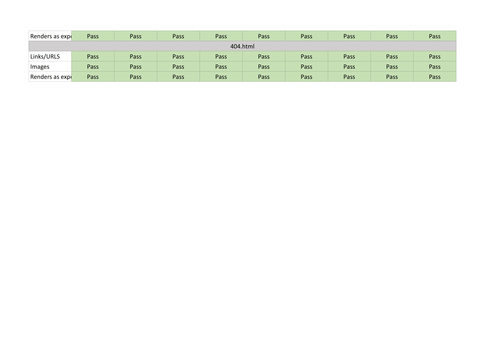

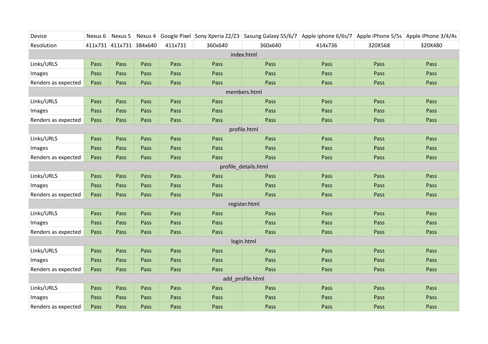
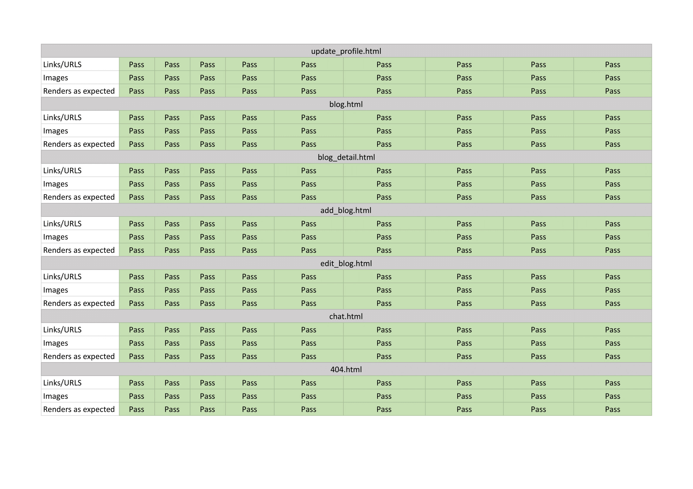

To ensure responsive design, I used bootstrap / CSS grid, flexbox, containers and custom media queries to ensure all site pages resized responsively for all mainstream device viewports.

### Browser Compatibility
The website has been manually tested using the following browers.
- Chrome 
- Edge
- Firefox
- Safari

## Testing User Stories

Browsing

* - As a user, I want the website to clearly display member’s profiles so I can be introduced to new members.
    - When a user logs in to their account, they will be able to access and view the member's page, which displays all the member's profile cards with a search function, for users to browse for specifc members the user may wish to find using full name or location of the members.
* - As a user, I want the website to clearly display the blog posts to me so I can be introduced to the content.
    - When a user logs in to their account, they will be able to access and view the blog post page, which displays all the blog posts contributed by all members in the community.
* - As a user,  I want the website to clearly display all the messages in the chat room.
    - When a user logs in to their account, they will be able to access and view the chat room, where they are able to communicate with other members and view all messages.

### Searching

* - As a user, I want to be able to search members by keyword, so I can find recipes easily, for example by name or location.
    - The serach function on the members page allows users to find / filter members by full name or location.
* - As a user, I want to be able to make connections with other members on the platform from search results.
    - Users are able to serach for other members and make connections via a button straight away from search results.

### Uploading Blog Posts

*  - As a user, I want to be able to upload my own blog posts, so other users can benefit from reading them.
* - As a user, I want to be able to edit and improve posts I have already uploaded.
* - As a user, I want to delete posts I have already uploaded.
    - Registered users are able to view all blog posts.
    - Registered users are able to uplaod blog posts.
    - Registered are able to edit and delete blog posts they have created.

### Users

*  As a user, I want to be able to register with the site, so I can upload and edit my profile and blog posts.
    - Users can register as a user profile via the 'registration' page, which requires users to provide with requried credentials. 
* - As a registered user, I want to be able to login to my account, so I can access and edit my profile, and to upload, edit or delete blog posts I created.
    - Users with registered accounts can log into their accoutn via the 'login' page, using their registered credentials.
*  As a registered user, I want to be able to make connections with other members and to remove them should I wish to.
    - Logged in users are able to view member's profile cards and make or remove connections with other members.
*  As a registered user, I want to communicate with other members on the platform.
    - Logged in users are able to send messages in the chat room.

### Site Owner Goals

*  - As the site owner, I would like the site to be  the “go-to” platform for users to learn and discuss cryptocurrency.
    - The webiste provide a opportunity for individuals to network with other members online to learn and share their insights on cryptocurrency. Members are able to communciate via the chat app or share their thoughts by contributing to the blog posts.

* - As the site owner, I would like to create a community for users in the blockchain technology / crypto market.
    - Members are able to connect with each other on the website and communicate with each other via the chat app.

*  - As the site owner,I would like to hear feedback from users to continuously improve user experience.
    - Users are able to contact the admin via the contact form in the home page.

### General

* - As a user I want to receive clear feedback for my actions on the site, so I know they are complete or if further steps are needed.
    - Where appropriate, visual responses, such as the hover effect, have been added to reflect user's actions.
* - As a user I want to contact the admin should I wish to.
    - Users are able to contact the admin via the contact form in the home page.

## Issues I had to overcome

**Chat Functionality**:

I decided that a chat functionality was essential to this app since its main goal is for people to connect and learn from each other. After adding the CRUD functionality, members are able to make connections with each other but there was no way for them to communicate. A form of communication was therefore crucial. A chat room is implemented onto the site using Socket.io.

**User Image Upload**:

There are two options for allowing users to upload images (profile, blog post);
  1. Allows users to provide a text URL to an online image.
  2. Embed image upload functonality to the site

The first option is the most striaght-forward, as it would only require saving a form text string to the database. Unfortunately, this does not allow as fluid a user experience as allowing users to upload the image directly to the site.

The alternative option would require the use of a third party widget called [Cloudinary](https://cloudinary.com/), which would allow users to upload their images onto the site directly. This is done by having the image saved to Cloudinary's cloud storage, in which a  URL would then be generated and saved to the database.

## Issues still to overcome
**User Image Upload**:
Currently, there is a default image for both the profile and the blog image. Users are able to upload their images by providing the URLs. This does not offer a fluid user experience. A better alternative would be to allow users to uplaod their image directly to the site. This can be done by using [Cloudinary](https://cloudinary.com/).

**Chat Functionality**:
Currently, there is an issue with the Chat functionality using socket.io. Messages are only displayed onto the chatroom after sending the second time. The chat app was working fine before I tried to add the 404 error handler. This got into conflict with the chat functionality as when there was an error, the page would be directed to chat.html instead of the 404.html. After many attempts to fix the codes with time constraint, I have decided to work on this at a later date.

**Forgotten/ Change Password**:
There is currently no function to allow users to recover or change their password. This functionality could be implemented in the future by using the integration of an e-mail system to send users account verification and reset password links.

